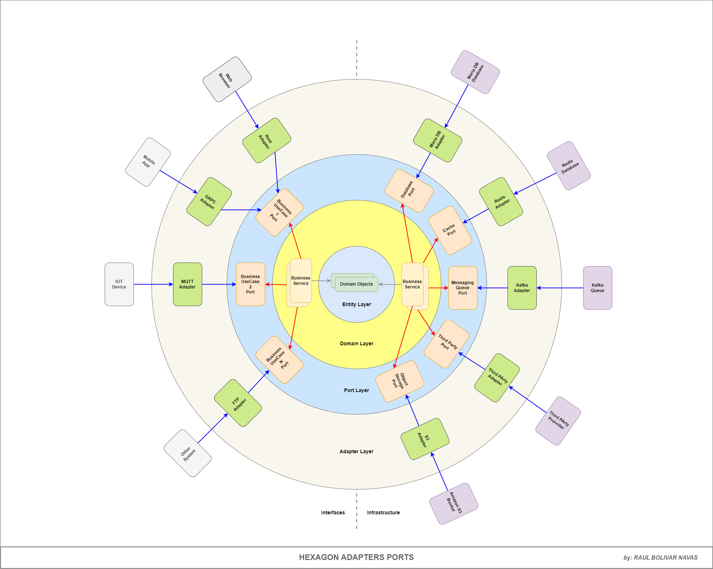
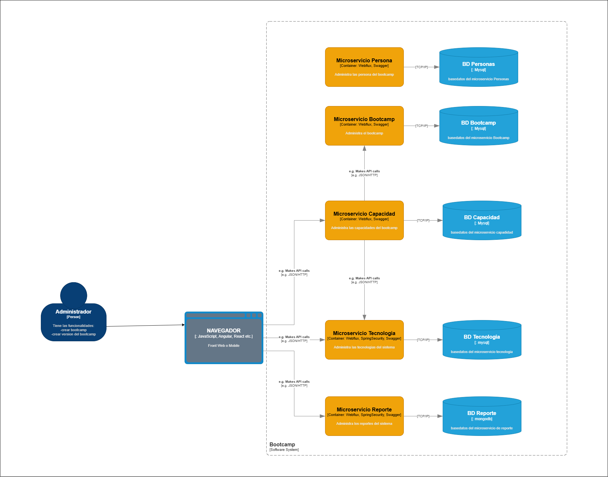
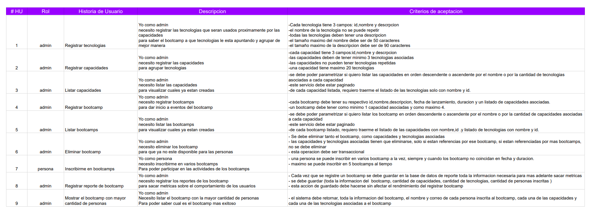
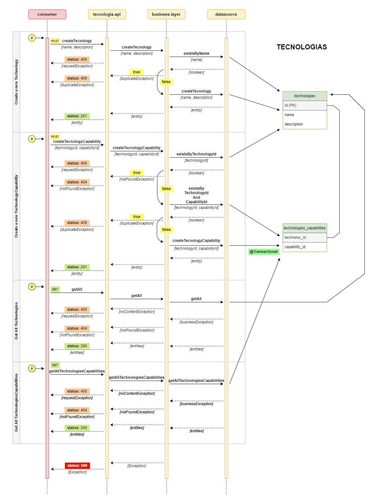

# bootcamp-reactivo

Chapter Backend APP for Bootcamp development services.

### Clean Architecture

This project is based on the Clean Architecture principles, which aim to create a clear separation of concerns and make the codebase more maintainable and testable. The architecture consists of several layers, each with its own responsibilities:

- **Domain Layer**: Contains the core business logic and entities. This layer is independent of any frameworks or external libraries.

- **Application Layer**: Contains the use cases and application-specific logic. This layer orchestrates the flow of data between the domain layer and the presentation layer.

- **Infrastructure Layer**: Contains the implementation details, such as database access, external APIs, and other technical concerns. This layer is responsible for interacting with the outside world.

### Microservices

This project is designed to be modular and can be easily split into microservices. Each module can be developed, deployed, and scaled independently, allowing for greater flexibility and maintainability.

- **Module 1**: Technologies Management (technologies-api)
- **Module 2**: Capabilities Management (capabilities-api)
- **Module 3**: Bootcamp Management (bootcamp-api)
- **Module 4**: Person Management (person-api)
- **Module 5**: Reports Management (reports-api)

### Architecture

### Database Relational

### History Use Cases

### Technologies

- Webflux
- Router Functions
- R2DBC
- MySQL
- MongoDB
- Lombok
- Actuator
- Validation
- WebClient
- Swagger
- Transactional
- Gradle
- Unit Test
- Integration Test

### Tecnologías API Management

### Author

- **[Raul Bolivar Navas](https://github.com/raulrobinson/reto-backend-reactivo)**

### License

This project is licensed under the MIT License. See the [LICENSE](LICENSE) file for details.

